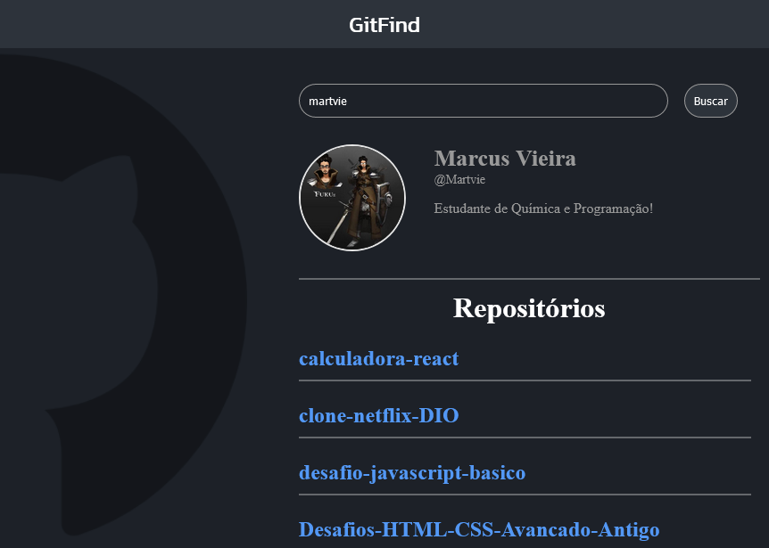

# GitFind

Projeto desenvolvido durante estudos de React usando como base a formação React na [DIO](https://dio.me/sign-up?ref=9RS1X8XBOV)
Você testar o projeto [clicando aqui](https://gitfind-dio.vercel.app/)

# imagens do projeto

## Tecnologias utilizadas

* JavaScript
* HTML
* CSS
* React
